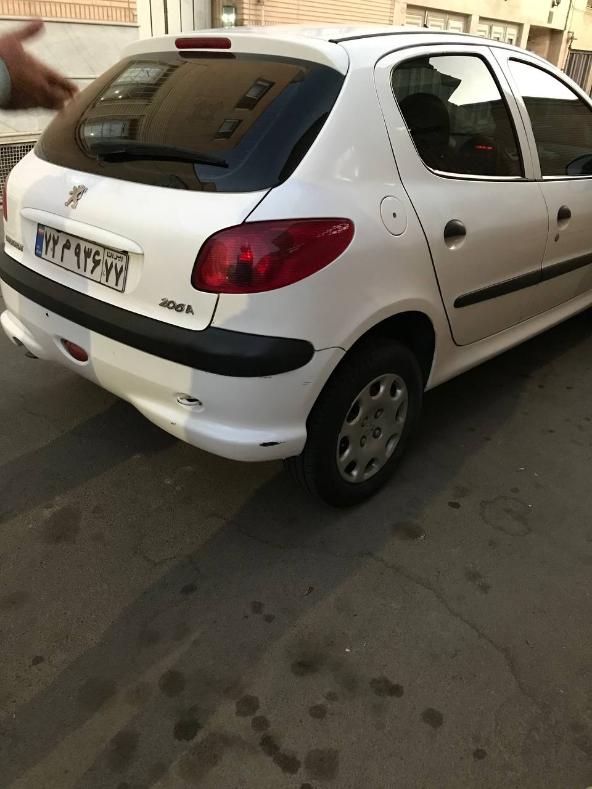
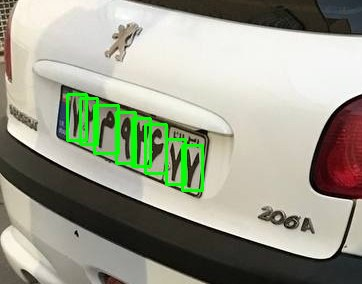
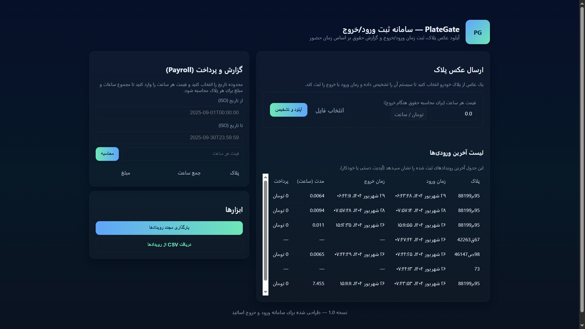

# PlateGate - Iranian License Plate Recognition System

[](https://opensource.org/licenses/MIT)
[](https://www.python.org/downloads/)
[](https://jupyter.org/)

**PlateGate** is an advanced system for recognizing Iranian vehicle license plates and managing entry/exit events. Built with modern technologies like **YOLO** for plate detection, **CNN** for character recognition, and **FastAPI** for the backend API, it provides a robust solution for automated vehicle tracking and billing based on parking duration. The project includes a user-friendly web interface for uploading images, viewing detection results, and generating payroll reports.


---

## Features
- **License Plate Recognition**: Detects Iranian license plates using YOLO and recognizes characters using a custom CNN model.
- **Entry/Exit Tracking**: Records vehicle entry and exit times in a SQLite database.
- **Billing Calculation**: Computes parking fees based on duration and hourly rate.
- **Web Interface**: A responsive, RTL-compliant interface for image uploads, result visualization, and event management.
- **Payroll Reporting**: Generates summaries of total hours and costs per license plate for a specified time range.
- **Data Security**: Stores images and sensitive data securely in a database and protected directories.

---

## Project Architecture
PlateGate consists of three main components:
1. **Backend (`app.py`)**:
   - Built with FastAPI for handling API requests.
   - Uses SQLite for persistent storage of entry/exit events.
   - Manages image uploads, plate recognition, and payroll calculations.
2. **Plate Recognition (`plate_recog.py`)**:
   - Utilizes YOLO for plate detection and a custom CNN for character recognition.
   - Supports image augmentation techniques (e.g., CLAHE, contrast adjustment) to improve detection accuracy.
   - Processes Iranian license plates with Persian characters and specific formats.
3. **Frontend (`home.html`)**:
   - A responsive web interface with RTL support for Persian users.
   - Allows users to upload images, view detection results, and generate reports.
   - Includes a table for recent events and a payroll calculator.

---

## Prerequisites
To run PlateGate, you need the following:
- **Python**: 3.8 or higher
- **Dependencies**:
  - FastAPI (`fastapi`)
  - SQLAlchemy (`sqlalchemy`)
  - OpenCV (`opencv-python`)
  - PyTorch (`torch`)
  - Ultralytics YOLO (`ultralytics`)
  - Other dependencies listed in `requirements.txt`
- **Model Files**:
  - YOLO model (`best.pt`) for plate detection
  - CNN model (`best_plate_model.pth`) for character recognition
- **Hardware**:
  - Optional: GPU with CUDA support for faster inference
  - Minimum: 4GB RAM, 10GB disk space for models and database

> **Note**: Model files (`best.pt`, `best_plate_model.pth`) and the database (`plategate.db`) are not included in this repository for security reasons. Users must provide their own trained models.

---

## Installation
1. **Clone the Repository**:
   ```bash
   git clone https://github.com/yourusername/plategate.git
   cd plategate
   ```
2. **Set Up a Virtual Environment** (recommended):
   ```bash
   python -m venv venv
   source venv/bin/activate  # On Windows: venv\Scripts\activate
   ```
3. **Install Dependencies**:
   ```bash
   pip install -r requirements.txt
   ```
   Sample `requirements.txt`:
   ```
   fastapi==0.115.0
   uvicorn==0.30.6
   sqlalchemy==2.0.32
   opencv-python==4.10.0
   torch==2.4.0
   ultralytics==8.2.90
   pillow==10.4.0
   numpy==1.26.4
   ```
4. **Provide Model Files**:
   - Place `best.pt` and `best_plate_model.pth` in the project root directory.
   - Ensure the paths in `app.py` and `plate_recog.py` match the model locations.
5. **Run the Server**:
   ```bash
   uvicorn app:app --host 0.0.0.0 --port 8000
   ```
6. **Access the Interface**:
   - Open `http://localhost:8000` in a browser to use the web interface (`home.html`).

---

## Usage
1. **Uploading an Image**:
   - Navigate to the web interface (`http://localhost:8000`).
   - Select an image of an Iranian license plate and specify the hourly rate.
   - Click "Upload and Detect" to process the image.
   - The system will detect the plate, register an entry/exit event, and display results (plate number, action, timestamps, duration, and cost).
2. **Viewing Events**:
   - The "Recent Events" table shows the latest entry/exit records.
   - Click "Refresh Events" to update the table.
3. **Generating Payroll Reports**:
   - Enter a date range (ISO format, e.g., `2025-09-01T00:00:00`) and hourly rate.
   - Click "Calculate" to view total hours and costs per plate.
4. **Exporting Data**:
   - Click "Download CSV" to export event data as a CSV file.

---

## Project Structure
```
plategate/
├── app.py                # FastAPI backend for API and database management
├── plate_recog.py        # Plate detection and recognition logic
├── home.html             # Web interface for user interaction
├── uploads/              # Directory for uploaded and annotated images
├── plategate.db          # SQLite database for event storage
├── best.pt               # YOLO model for plate detection (not included)
├── best_plate_model.pth  # CNN model for character recognition (not included)
├── requirements.txt      # Python dependencies
└── README.md             # Project documentation
```

---

## Limitations for Browser-Based Deployment
PlateGate cannot be fully deployed in a browser-based environment (e.g., using Pyodide/Emscripten) due to the following constraints:
- **Heavy Dependencies**: Libraries like OpenCV and PyTorch are not fully supported in Pyodide.
- **Model Size**: The YOLO and CNN model files are too large for browser-based execution.
- **File I/O**: Pyodide does not support local file operations (e.g., saving images to `uploads/` or accessing `plategate.db`).
- **Server Requirement**: The FastAPI backend requires a server environment, which is incompatible with browser-based execution.

For these reasons, only the `README.md` is shared publicly to describe the project. The full codebase and models are maintained in a private repository or local environment.

---

## Security Considerations
- **Sensitive Files**: Model files (`best.pt`, `best_plate_model.pth`) and the database (`plategate.db`) are excluded from public repositories to prevent unauthorized access.
- **Image Privacy**: Uploaded images in the `uploads/` directory may contain sensitive data (e.g., real license plates) and are not shared.
- **Secure Deployment**: For public demos, deploy the backend on a private server and expose only the web interface, with authentication if needed.

---

## Demo
Due to the sensitive nature of the project, a live demo is not provided in this repository. To see PlateGate in action:
1. Deploy the project locally or on a private server as described in the Installation section.
2. Contact the repository owner for access to a private demo (if available).

*Sample output (mock-up):*  




.png)

---


---

## Contributing
Contributions are welcome! Please fork the repository and submit a pull request with your changes. For major contributions, contact the repository owner to discuss model access or implementation details.

---

## Contact
For questions or inquiries, please contact [pourya fakhimi] at [pouryafakhimi0943@gmail.com] or open an issue on GitHub.

